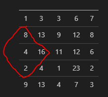

# 파리퇴치_remake

## 문제

N x N 배열 안의 숫자는 해당 영역에 존재하는 파리의 개수를 의미한다.  

다음은 N = 5의 예이다  

| | | | | |
|:---:|:---:|:---:|:---:|:---:|
1|3|3|6|7
8|13|9|12|8
4|16|11|12|6
2|4|1|23|2
9|13|4|7|3

효승이는 파리채를 한 번 내리쳐 최대한 많은 파리를 죽이고자 한다.  
파리채는 각 대각선의 크기가 M x M 인 다이아몬드 모양의 파리채이다.  
죽은 파리의 개수를 구하라!  

예를 들어 M=3일 경우, 주어진 배열의 정 가운데 arr[2][2]에 파리채를 내리친다고 가정할 때  
9, 16, 11, 12, 1 이 파리채의 범위에 들어가게 된다

#### [주의사항]
파리채가 주어진 파리 배열의 경계를 맞춰, 파리채의 일부 범위가 벗어나는 경우도 고려한다.

### [제약 사항]
1. N은 5이상 15이하이다.
2. M은 3 이상 N 이하의 **홀수**이다.
3. 각 영역의 파리 갯수는 30 이하이다.

### [입력]
가장 첫 줄에는 테스트 케이스의 개수 T가 주어지고, 그 아래로 각 테스트 케이스가 주어진다

각 테스트 케이스의 첫 번째 줄에 N과 M이 주어지고,

다음 N 줄에 걸쳐 N x N 배열이 주어진다 각 값은 공백으로 구분되어 있다.

### [출력]
출력의 각 줄은 '#t'로 시작하고, 공백을 한 칸 둔 다음 정답을 출력한다.

(t는 테스트 케이스의 번호를 의미하며 1부터 시작한다.)